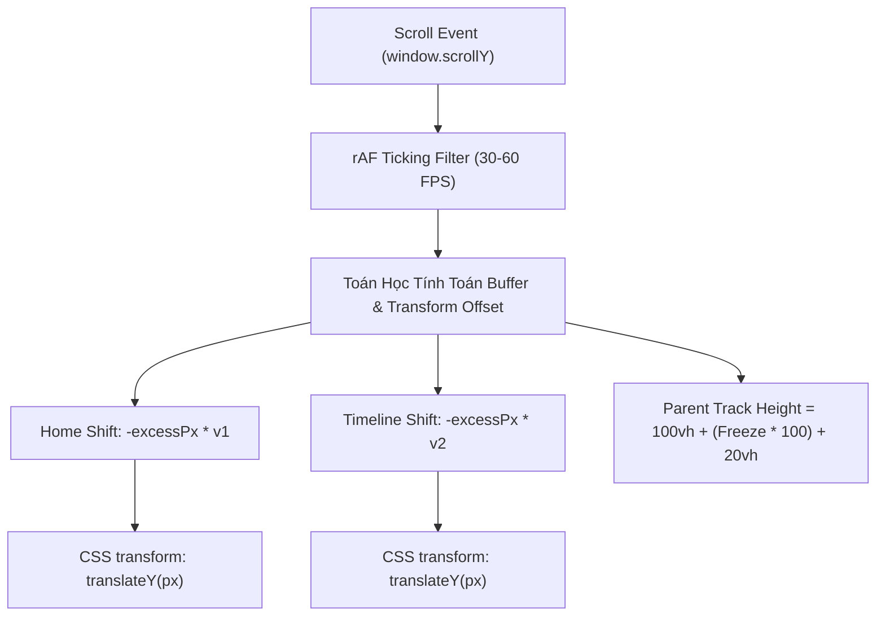

# SCROLL BUFFER & ACCELERATED OVERLAP ARCHITECTURE
> **Tài liệu Kỹ thuật Kiến trúc Cuộn Trang, Vùng Đệm (Buffer) & Hiệu ứng Parallax 60 FPS**

Tài liệu này tổng hợp toàn bộ bài toán, lỗi phổ biến, nguyên lý toán học và giải pháp kiến trúc tối ưu hiệu năng để xử lý hiệu ứng cuộn trang (Scroll), vùng đệm đứng yên (Buffer Freeze) và chuyển cảnh chồng đè (Overlapping Cards) mượt mà trong Next.js / React.

---

## 📖 MỤC LỤC
1. [Đặt Vấn Đề & Yêu Cầu Thiết Kế](#1-đặt-vấn-đề--yêu-cầu-thiết-kế)
2. [Các Lỗi Thường Gặp & Nguyên Nhân Góc Rễ](#2-các-lỗi-thường-gặp--nguyên-nhân-góc-rễ)
3. [Giải Pháp Kiến Trúc Tối Ưu](#3-giải-pháp-kiến-trúc-tối-ưu)
4. [Mô Hình Toán Học & Công Thức Chuyển Động](#4-mô-hình-toán-học--công-thức-chuyển-động)
5. [Tối Ưu Hiệu Năng 60 FPS & Tiết Kiệm GPU](#5-tối-ưu-hiệu-năng-60-fps--tiết-kiệm-gpu)
6. [Hướng Dẫn Cấu Hình Nhanh (Cheat Sheet)](#6-hướng-dẫn-cấu-hình-nhanh-cheat-sheet)

---

## 1. Đặt Vấn Đề & Yêu Cầu Thiết Kế

Khi xây dựng các trang web Landing Page hoặc Event Showcase cao cấp, thiết kế thường yêu cầu:
- **Thẻ 1 (Home/Hero)**: Đứng yên một khoảng `vh` (Buffer) để người dùng đọc nội dung, sau đó trượt lên nhẹ nhàng với vận tốc $v_1$ (Parallax Damping).
- **Thẻ 2 (Timeline)**: Đứng chờ một khoảng `vh`, sau đó bứt tốc trượt lên với vận tốc $v_2$ lớn hơn ($v_2 > v_1$) để đè phủ lên Thẻ 1 một cách dứt khoát.
- **Yêu cầu bắt buộc**: 
  - Không giật lắc, không nảy khung (jittering).
  - Không bị chuyển đổi hướng vận tốc đột ngột (tụt xuống rồi lại vụt lên).
  - Chạy mượt 60 FPS trên mọi độ phân giải.

---

## 2. Các Lỗi Thường Gặp & Nguyên Nhân Góc Rễ

### ❌ Lỗi 1: Cảm giác "vừa trượt lên vừa trượt xuống" (Velocity Inversion)
- **Nguyên nhân**: Khi thẻ đã được ghim bằng `position: sticky; top: 0;`, vận tốc của thẻ so với màn hình đã bị triệt tiêu về $0$. Nếu tiếp tục áp dụng transform dương `translateY(+20vh)`, phần tử sẽ bị đẩy **tụt lùi xuống dưới** ($v < 0$). Khi hết vùng sticky, phần tử lại bị cuộn **vọt lên trên** ($v > 0$).
- **Hệ quả**: Chuỗi vận tốc $0 \rightarrow \text{Âm} \rightarrow \text{Dương}$ làm mắt nhận diện hai chuyển động giằng co ngược chiều.

### ❌ Lỗi 2: Vừa cuộn chuột là thẻ đã bị kéo trượt lên (Sticky Boundary Exhaustion)
- **Nguyên nhân**: Bản chất của `position: sticky` là phần tử con chỉ đứng yên **trong phạm vi chiều cao của khung chứa cha (Parent Container)**.
  $$\text{Khoảng đứng yên tối đa của Sticky} = \text{Height}_{\text{parent}} - \text{Height}_{\text{sticky child}}$$
  Nếu `HOME_FREEZE_VH = 5.0` (muốn đứng yên 5 màn hình), nhưng khung cha chỉ dài `110vh`, thì dung lượng sticky chỉ là $110\text{vh} - 100\text{vh} = 10\text{vh}$ (~80px). Hết 80px, khung cha hết chiều cao làm `sticky` bị giải phóng ➔ Thẻ lập tức bị kéo vụt lên theo luồng văn bản tự nhiên.

---

## 3. Giải Pháp Kiến Trúc Tối Ưu

Hệ thống xử lý được chia làm 3 lớp phụ thuộc lẫn nhau:



### 🔑 Key Takeaways:
1. **Khung chứa cha tự động co giãn**: Chiều cao khung chứa cha (`HOME_TRACK_HEIGHT_VH`) phải được tính tự động dựa trên `HOME_FREEZE_VH`.
2. **Transform luôn cùng hướng (Negative Offset)**: Mọi giá trị `translateY` trong giai đoạn di chuyển đều mang dấu âm (`-`), triệt tiêu hoàn toàn sự đổi hướng vận tốc.

---

## 4. Mô Hình Toán Học & Công Thức Chuyển Động

Gọi $sy = \text{window.scrollY}$ và $vh = \text{window.innerHeight}$.  
Tỷ lệ cuộn theo màn hình: $\text{scrollVh} = \frac{sy}{vh}$.

### A. Công Thức Chiều Cao Khung Cha (Parent Track Height)
$$\text{HOME\_TRACK\_HEIGHT\_VH} = 100 + (\text{HOME\_FREEZE\_VH} \times 100) + 20$$
*Đảm bảo khung cha luôn dư độ dài cho CSS Sticky hoạt động trọn vẹn $100\%$ đúng số `vh` đệm.*

### B. Công Thức Dịch Chuyển Thẻ Home (Home Shift)
$$\text{homeShift} = \begin{cases} 0 & \text{khi } \text{scrollVh} \le \text{HOME\_FREEZE\_VH} \\ -(sy - \text{HOME\_FREEZE\_VH} \times vh) \times v_1 & \text{khi } \text{scrollVh} > \text{HOME\_FREEZE\_VH} \end{cases}$$

### C. Công Thức Dịch Chuyển Thẻ Timeline (Timeline Shift)
$$\text{timelineShift} = \begin{cases} 0 & \text{khi } \text{scrollVh} \le \text{TIMELINE\_FREEZE\_VH} \\ -(sy - \text{TIMELINE\_FREEZE\_VH} \times vh) \times v_2 & \text{khi } \text{scrollVh} > \text{TIMELINE\_FREEZE\_VH} \end{cases}$$

---

## 5. Tối Ưu Hiệu Năng 60 FPS & Tiết Kiệm GPU

Để đạt hiệu năng cao không bị drop frame hay lag trên thiết bị yếu:

1. **Debounce với `requestAnimationFrame`**:
   ```typescript
   let ticking = false;
   const handleScroll = () => {
     if (!ticking) {
       window.requestAnimationFrame(() => {
         // Tính toán Parallax ở đây...
         ticking = false;
       });
       ticking = true;
     }
   };
   ```

2. **GPU Compositing Layer (`will-change: transform`)**:
   Gắn class `will-change-transform` lên các thẻ container để trình duyệt đưa phần tử lên GPU Layer riêng, tránh re-render / repaint toàn bộ cây DOM.

3. **Tự Động Unmount / Hide Thẻ Phía Dưới (GPU Memory Saving)**:
   Khi thẻ Timeline đã bứt tốc trượt lên che kín 100% thẻ Home, tiến hành unmount hoặc ẩn thẻ Home (`isHomeVisible = false`) để giải phóng GPU khỏi việc duy trì render các animation nặng bên trong thẻ Home.

---

## 6. Hướng Dẫn Cấu Hình Nhanh (Cheat Sheet)

Vị trí các hằng số cấu hình trong `src/app/page.tsx`:

```typescript
// A. THẺ HOME:
const HOME_FREEZE_VH = 1.0;  // Đứng yên 1.0vh trước khi trượt
const HOME_SPEED_V1  = 0.2;  // Vận tốc trượt lên = 20% tốc độ cuộn

// B. THẺ TIMELINE:
const TIMELINE_FREEZE_VH = 0.0;  // Trượt ngay không chờ
const TIMELINE_SPEED_V2  = 0.45; // Vận tốc trượt lên bứt tốc = +45% tốc độ cuộn

// C. TỰ ĐỘNG CÂN BẰNG CHIỀU CAO KHUNG:
const HOME_TRACK_HEIGHT_VH = 100 + (HOME_FREEZE_VH * 100) + 20;
```


---

## 7. Custom Hook Tái Sử Dụng (`useScrollParallax`)

Để áp dụng hiệu ứng cuộn, đệm buffer và khống chế vận tốc cho **BẤT KỲ phần tử nào trong dự án**, bạn chỉ cần import và sử dụng hook `useScrollParallax`:

```tsx
import { useScrollParallax } from '@/hooks/useScrollParallax';

function MyFeatureComponent() {
  // Đứng yên 1.5vh, sau đó trượt lên với vận tốc 30% tốc độ scroll
  const cardScroll = useScrollParallax({
    freezeVh: 1.5,
    speed: 0.3,
    direction: 'up',
  });

  return (
    <div style={cardScroll.trackHeightStyle}>
      <div style={cardScroll.style}>
        {/* Nội dung phần tử của bạn */}
      </div>
    </div>
  );
}
```

### 📋 Bảng Tham Số (Options):
| Tham Số | Kiểu Dữ Liệu | Mặc Định | Mô Tả |
| :--- | :--- | :--- | :--- |
| `freezeVh` | `number` | `0.0` | Số lượng `vh` phần tử đứng yên 100% trước khi trượt |
| `pauseDuringFreeze` | `boolean` | `false` | Giữ phần tử đứng im đúng vị trí mép màn hình ban đầu (không tốn chiều cao DOM cha) |
| `speed` | `number` | `0.2` | Hệ số vận tốc trượt ($0.2 = 20\%$, $0.5 = 50\%$) |
| `direction` | `'up' \| 'down'` | `'up'` | Hướng dịch chuyển (`'up'` trượt lên, `'down'` trượt xuống) |
| `triggerStartVh` | `number` | `0.0` | Mốc cuộn `vh` bắt đầu kích hoạt hiệu ứng |
| `trackHeightVh` | `number` | *(Tự tính)* | Chiều cao khung cuộn (`100 + freezeVh * 100 + 20`) |

### 📤 Kết Quả Trả Về (Return Values):
- `style`: Object CSS ready-to-use `{ transform: 'translateY(...)', willChange: 'transform' }`
- `trackHeightStyle`: Object CSS chiều cao khung chứa `{ height: '...vh' }`
- `isFrozen`: `true` khi đang trong vùng đệm đứng yên
- `isSliding`: `true` khi đang trong quá trình trượt
- `progress`: Tiến trình trượt từ `0.0` đến `1.0`

---

## 8. Bài Học Thực Tế & Lưu Ý Khi Cấu Hình (Troubleshooting & Best Practices)

### ⚠️ Lưu Ý 1: Tránh `triggerStartVh` cộng nối tiếp gây khựng vận tốc (Velocity Discontinuity)
- **Hiện tượng**: Nếu truyền `triggerStartVh = HOME_FREEZE_VH` vào thẻ Timeline ở dưới, thẻ Timeline sẽ bị đứng im chờ đến khi qua $1.0\text{vh}$ rồi mới bứt tốc đột ngột ➔ Gây ra độ trễ khựng vận tốc khiến cuộn trang bị sượng.
- **Quy tắc chuẩn**: Giữ `triggerStartVh = 0.0` (mặc định) cho các thẻ xếp tiếp nối trong HTML. Việc này giúp thẻ trượt liên tục mượt mà ngay từ điểm khởi đầu $sy = 0$ mà không bị sượng nhịp.

### 💡 Lưu Ý 2: Quy Tắc Phối Cặp Vận Tốc ($v_1, v_2$) Đẹp Nhất
- **Thẻ Home ($v_1$)**: Chọn nhỏ ($0.05 \rightarrow 0.2$) để thẻ Home chỉ trượt nhẹ tạo nền độ sâu.
- **Thẻ Timeline ($v_2$)**: Chọn vừa đến cao ($0.25 \rightarrow 0.45$) để thẻ Timeline nhanh chóng bứt tốc vọt lên đè phủ trọn vẹn thẻ Home.

---

## 9. Đánh Giá Kiến Trúc: Vì Sao Chọn Cơ Chế 1 & Loại Bỏ Cơ Chế 2?

Trong quá trình thực nghiệm, hai cơ chế đóng băng thẻ (Buffer Freeze) đã được so sánh:

### ❌ Cơ Chế 2 (JavaScript Transform Counter-Scroll `translateY(+sy)`):
- **Cơ chế**: Dùng JS liên tục gán `translateY(+sy)` đối ứng với đà cuộn chuột `-sy` để giữ phần tử đứng yên mà không tăng chiều cao khung chứa.
- **Kết quả nghiệm thu**: **LOẠI BỎ vì bị LAG / DROP FRAME**. Việc liên tục tính toán và can thiệp CSS Transform trên Main Thread làm xé hình và không đạt chuẩn 60 FPS khi người dùng cuộn nhanh.

### ✅ Cơ Chế 1 (Chuẩn Kiến Trúc - Native CSS `position: sticky` + Track Height Scaling):
- **Cơ chế**: Khung chứa cha tự động mở rộng chiều cao theo `computedTrackHeightVh = 100 + freezeVh * 100 + 20`. Thẻ con bên trong dùng CSS `position: sticky; top: 0;`.
- **Kết quả nghiệm thu**: **CHUẨN KIẾN TRÚC MƯỢT 100% (60-120 FPS)**. Trình duyệt tự xử lý ghim phần tử bằng GPU Compositor Thread ở tầng phần cứng, mượt mà tuyệt đối không tiêu tốn CPU.

---

*Tài liệu được cập nhật và lưu trữ tại `docs/SCROLL_BUFFER_PARALLAX_GUIDE.md`.*

